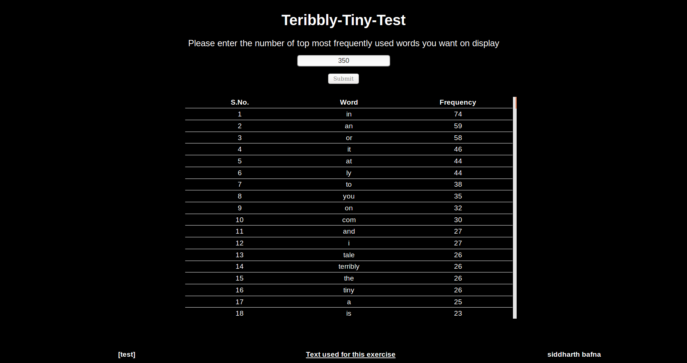
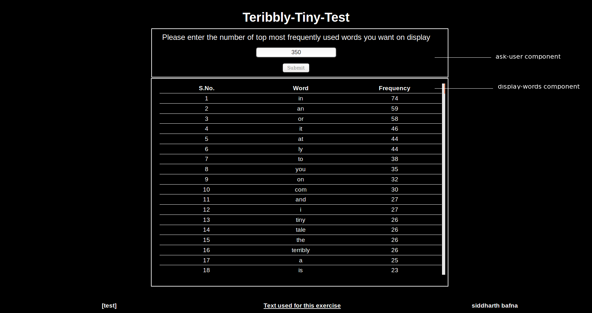
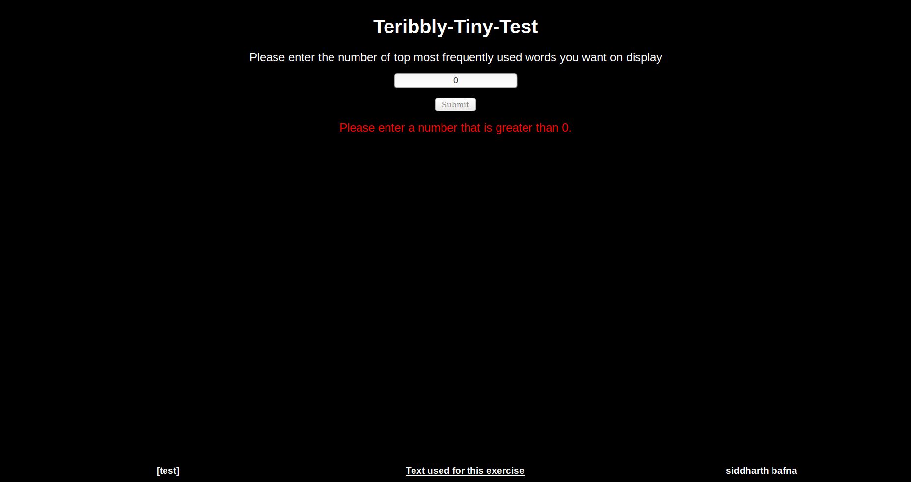

# FrequencyComputation

The project serves as a test for Job Application for the position of Software Developer at Terribly Tiny Tales.

This document will serve as a guide to get better understanding of different components of the project. The document contains explanations of components of code, as well as some personal notes from my side. The notes are a version of my thought process at the time of coding a particular component and the reason behind it.

## Aim

1. The aim of the project was to create a fronted that accepts a number input N
2. On click of submit button, a request is to be sent to the backend. The request will contain the user input N
3. At backend, fetch a file hosted at http://terriblytinytales.com/test.txt
4. The backed will process this file and return the top N most frequently used words in the file
5. Finally, the backend will display these words in a serialized tabular format

The project can be divided into two parts: `Backend` and `Frontend`. Both of these will be explained in detail.

## Backend

Framework: [ExpressJs](https://expressjs.com/)

Backend code is in the file named, `server.js`.

Start the backend server: `node server.js`

Run `node server.js` on CLI to run the backend node server. The server will run on `http://localhost:8000/` and application will listen for requests on port 8000.

Once the app receives a get request from frontend on `api/words/:userInput`, it'll call the `readTextFile` function.

The `readTextFile` function will utilize `node-fetch` to fetch the text file hosted at (http://terriblytinytales.com/test.txt). The text will be extracted from the response and the text body will be fed to another function `textToWords`.

`textToWords` is basically the first step in our process of frequency computation of words. The input to this function is a text which contains different types of spacing characters (single space, tab`\t`, next line character`\n`), various symbols (`@`, `:`, `_`, `?` etc.) and punctuations(`.`, `,` , `"` etc.) and also numbers that we don't need.  The idea is to remove all these from the text and store just the words in an array which can be used for frequency computation of words. `split` helps us with this.

### Note: 

> At first, I tried by splitting the text at some of these characters, but to do that for each and every character didn't seem like an efficient process. So, to find a better way I googled, and discovered with the help of `stackoverflow` that `split` command can work upon a regex. This made the process of splitting text over different characters an easy task.

The `text` is `split` on  this regex `/[.,@:_;?\/\(\)\t\n"<>0-9– ]/` and the result is saved in `words` array.

### Note:

> Initially, I included hyphen(`-`) in the regex, but that caused an issue. If we include `-` in the regex then the words like, `t-shirts` and `e-commerce` will split into `t` `shirts` and `e` `commerce` respectively. Now, the words array will have `shirts` and `commerce`  elements which qualify as words but also `t` and `e` which do not qualify as words in my opinion. Also, my opinion was that words like, `t-shirts` and `e-commerce` are words in their own right, so there is no need to split these. For this reason, I excluded `-` from the `regex`. But this caused another problem, in the text there are words like, `terribly-tiny-tales` and `terribly-tiny-test` that are combination of multiple words, and in my opinion should be split.

To tackle the  above issue, I wrote a separate function `hyphenSplit`. This function will check if the words in the array contain `-`, and  if the `-` is in the first position (`t-shirts`, `e-commerce`); if the `-` is not at the first position then the `word` will be `split` over `-` otherwise not. The `pros` of this is that now we can save words like `t-shirts` and split words like, `terribly-tiny-test`. The `cons` is that if the text  contains a word like `co-passenger`, it'll be split in `co` and `passenger`.

The final decision to implement this will be based upon the developer's discretion, and he or she can use it or not by commenting out or uncommenting the `words = hyphenSplit(words)` command in the `textToWords` function.   

I've decided to use this function.

After the text is `split` and the result saved to `words` array, the array is served as an input to frequency computation function. I wrote two such functions which differ slightly.

`simpleFrequencyComputation`: This is for `absolute match`. Example, word `tale` is present in `tale` as well as in `tales`. This will only match with `tale`.

`frequencyComputation`: This will perform `absolute match` for single letter words like `a` and `i`. But for words with length greater than 1, this function will perform an includes match. Example, word `a` is present in word `a`, `tale`, `tales`, `talented`, but it'll match with `a` only. Thus, `frequency` of `a` will be `1`. Now, if word in consideration is `tale`, in this function it'll match with `tale`, `tales` and `talented`, giving it's frequency as `3` and not  `1` as was the case with `simpleFrequencyComputation`.

Both these functions, `simpleFrequencyComputation` and `FrequencyComputation` have some common traits:

1. Both check for empty elements  `""` that are present in the `words` array due to `split`, and both check if a word's frequency has been computed already.

2. Both send the final `frequencyArray` for sorting in `descending` order on the basis of `frequency`.

This is again on developer's discretion which type of Frequency Computation, he or she wants.

The following are the screenshots of the results displayed on frontend:

#### simpleFrequencyComputation with hyphenSplit. Word `i` has the highest frequency:

>   

#### frequencyComputation with hyphenSplit. Word `in` has the highest frequency:

>   

#### `simpleFrequencyComputation` without `hyphenSplit`. `terribly-tiny-test` is present as a single word:

>   

#### `frequencyComputation` without `hyphenSplit`. `terribly-tiny-test` is not present as a single word:

>   

### Note:
CORS has been implemented in `server.js` to avoid `Cross Origin Resource Sharing` issue.

## Frontend

Framework: AngularJS

This project was generated with [Angular CLI](https://github.com/angular/angular-cli) version 6.0.5.

`src/app/` folder is where all frontend `components` and `services` are present

Run `ng serve --open` on CLI for a dev server. Navigate to `http://localhost:4200/`. The app will automatically reload if you change any of the source files.

Run `ng generate component component-name` on CLI to generate a new component.

Run `ng generate service service-name` on CLI to generate a new component.

There are two components (`ask-user` and `display-words`) and one service (`words`) created. One other default `app` component is present.

The whole page is `app` component; `ask-user` and `display-words` are called inside this component.

#### The screenshot below shows both the components in display:

> 

When the user enters an input and presses submit `getWords` present in `ask-user.component` is called. The function first checks if the `input` is a `number greater than 0` or not. If not then functions present in `words.service`, which acts as a connection between `ask-user` and `display-words` are called upon to log an error on screen.

#### Error logging in case `input` is not a number or is zero:

> 

If the `input > 0` then, `callDisplayWords` present in  `words.service` is called upon, which in turn calls `getWords` function present in `display-words` component. This function again uses the `words.service` to make a `get` request to server with the `userInput`.

If the request catches any error then again a error message is logged on screen.

#### Error logging in case of `get` request failure:

> 

If everything goes right, the number of most frequently used words the user asked for are displayed on screen.

#### Display of top 6 frequently used words with `frequencyComputation`:

>   

#### Display of top 6 frequently used words with `simpleFrequencyComputation`:

>   

## Final notes for the TTT

1. I thought of adding a `check` for `internet-connectivity` to make sure app can fetch the text file hosted at remote server. But, decided against it at this moment. But, that can be done to enhance the user experience.

2. After submission, I'll be working to host this on `heroku`. I am not doing this now because I am not sure if you are still hiring and I don't want to delay the submission.

3. Whenever you see this, please let me know how close is this to your required solution; irrespective of whether I am hired or not.